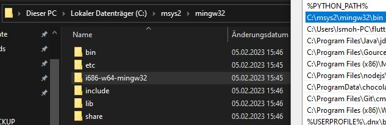

# Install luarocks on Windows with Lua 5.1 and LuaJIT-2.0.4

## Install MSVC 2022
1. Download and install [MSVC 2022](https://visualstudio.microsoft.com/de/downloads/#build-tools-for-visual-studio-2022).
2. Search for vcvarsall.bat and copy the path to the clipboard.
3. Put the path to Windows environment variable `PATH` (e.g. `C:\Program Files (x86)\Microsoft Visual Studio\2022\BuildTools\VC\Auxiliary\Build`).
4. After that you can run `vcvarsall` from any directory.

[More about vcvarsall!](https://learn.microsoft.com/en-us/cpp/build/building-on-the-command-line?view=msvc-170#developer_command_file_locations)

## Install and init luarocks

1. Open `cmd.exe` as *administrator*
2. Change directory to `NoitaMP\mods\noita-mp`, like `cd fullPathTo\NoitaMP\mods\noita-mp`.
3. Run the following command as *administrator* in `cmd.exe`:
   ```cmd
   cd fullPathTo\NoitaMP\mods\noita-mp
   set INIT_PATH=%CD%
   
   REM // resolve absolute path
   set REL_PATH=..\..\.building\luarocks-3.9.1-windows-32
   set ABS_PATH=
   rem // Save current directory and change to target directory
   pushd %REL_PATH%
   rem // Save value of CD variable (current directory)
   set ABS_PATH=%CD%
   rem // Restore original directory
   popd   
   echo Relative path: %REL_PATH%
   echo Maps to path: %ABS_PATH%
   
   REM // make use of LuaJIT-2.0.4  
   %ABS_PATH%\luarocks config --local variables.LUA_BINDIR %INIT_PATH%\..\..\LuaJIT-2.0.4\bin
   %ABS_PATH%\luarocks config --local variables.LUA_DIR %INIT_PATH%\..\..\LuaJIT-2.0.4
   %ABS_PATH%\luarocks config --local variables.LUA_INCDIR %INIT_PATH%\..\..\LuaJIT-2.0.4\include
   
   REM // init luarocks
   %ABS_PATH%\luarocks --lua-version="5.1" init noita-mp --output="%INIT_PATH%" --homepage="https://github.com/Ismoh/NoitaMP" --lua-versions="5.1" --license="GNU GPL v3"
   ```
   [source for above](https://stackoverflow.com/questions/1645843/resolve-absolute-path-from-relative-path-and-or-file-name)
4. Result should look like this:
   ```cmd
   Initializing project 'noita-mp' for Lua 5.1 ...
   -----------------------------------------------
   
   Checking your Lua installation ...
   
   Wrote template at D:\______BACKUP\NoitaMP_repo\NoitaMP\mods\noita-mp -- you should now edit and finish it.
   
   Adding entries to .gitignore ...
   Preparing ./.luarocks/ ...
   Wrote .luarocks/config-5.1.lua
   Preparing ./lua_modules/ ...
   Preparing ./luarocks.bat ...
   Preparing ./lua.bat for version 5.1...
   ```
5. If you run `luarocks` in `NoitaMP\mods\noita-mp` directory, it should work now.

## Make use of LuaJIT-2.0.4
1. Check LuaJITs doc for compiling it on [Windows](https://luajit.org/install.html#windows).
2. After compiling LuaJIT, copy the following files into destination directory: ([Double check here on 3.](https://gist.github.com/Egor-Skriptunoff/cb952f7eaf39b7b1bf739b818ece87cd))
   - `luajit.exe` and `lua51.dll` into `NoitaMP\LuaJIT-2.0.4\bin`
   - `lua51.lib` into `NoitaMP\LuaJIT-2.0.4\lib`
   - Install jit.* modules by copying `NoitaMP\.building\LuaJIT-2.0.4\src\jit` into `NoitaMP\LuaJIT-2.0.4\jit`
   - Add includes by copying `lauxlib.h`, `lua.h`, `lua.hpp`, `luaconf.h`, `lualib.h` from `NoitaMP\.building\LuaJIT-2.0.4\src` into `NoitaMP\LuaJIT-2.0.4\include`
3. Change `config-5.1.lua` like so, but use your local absolute path to `NoitaMP\LuaJIT-2.0.4\`:
   ```lua
   lua_interpreter = "luajit.exe"
   variables = {
    LUA_DIR    = "yourAbsolutePathTo\\NoitaMP\\LuaJIT-2.0.4", -- LUA_DIR = "C:\\msys64\\mingw32",
    LUA_BINDIR = "yourAbsolutePathTo\\NoitaMP\\LuaJIT-2.0.4\\bin", -- LUA_BINDIR = "C:\\msys64\\mingw32\\bin",
    LUA_INCDIR = "yourAbsolutePathTo\\NoitaMP\\LuaJIT-2.0.4\\include", -- LUA_INCDIR = "C:\\msys64\\mingw32/include/lua5.1",
    LUA_LIBDIR = "yourAbsolutePathTo\\NoitaMP\\LuaJIT-2.0.4\\lib"
   }
   ```
4. Run `luarocks` in `\NoitaMP\mods\noita-mp` directory again. Done!

## Create a rockspec
`luarocks write_rockspec --license="GNU GPL v3" --lua-versions="5.1" --rockspec-format="3.0"`

## Run unit test
Change dir to `NoitaMP\mods\noita-mp` and run `luarocks test`.
If you want to store logs, run `luarocks test > result.log`.

## Check for updates on dependencies
Run `luarocks list` in `NoitaMP\mods\noita-mp` directory.

## Install dependencies
Run
```
call "C:\Program Files (x86)\Microsoft Visual Studio\2022\BuildTools\VC\Auxiliary\Build\vcvarsall.bat" x86 10.0.22000.0 -vcvars_ver=14
luarocks install {name}
```
in `NoitaMP\mods\noita-mp` directory.


## Install all dependencies defined in noita-mp-*.rockspec
Run `luarocks install --only-deps noita-mp-*.rockspec`. Replace `*` with the version number of the rockspec.
Simply type in `luarocks install --only-deps noita` and hit tab to autocomplete the rockspec name.


## Build zstandard
~~https://fuchsia.googlesource.com/third_party/zstd/+/refs/tags/v1.3.7/build/~~
~~https://stackoverflow.com/questions/44290672/how-to-download-visual-studio-community-edition-2015-not-2017 use ISO Image community~~
~~As Visual Studio doesn't seem to be working, I am trying to use MSYS2 again:~~\
~~[Install MSYS2](https://www.msys2.org/). I used msys2.exe~~\
~~Then `pacman -Syu`, after that [Install mingw32 toolchain](https://docs.epics-controls.org/projects/how-tos/en/latest/getting-started/installation-windows-msys2.html), but only use `pacman -S mingw-w64-i686-toolchain` to be sure to have 32bit toolchain.~~\
~~`pacman -S mingw-w64-i686-cmake`~~
~~Make sure MSYS2 path is set in windows PATH:~~\
~~~~\
~~Then change LuaRocks CC variable:~~
~~```~~
~~luarocks config --scope="project" variables.CC gcc && ^~~
~~luarocks config --scope="project" variables.LD gcc~~
~~```~~
~~After that in cmd as admin:~~\
~~`luarocks install lua-zstd ZSTD_DIR=D:\______BACKUP\NoitaMP_repo\NoitaMP\.building\zstd-v1.5.2-win32`~~
All of this fails! Simply use prebuild dll from https://github.com/facebook/zstd/releases zstd-v1.5.2-win32.zip


