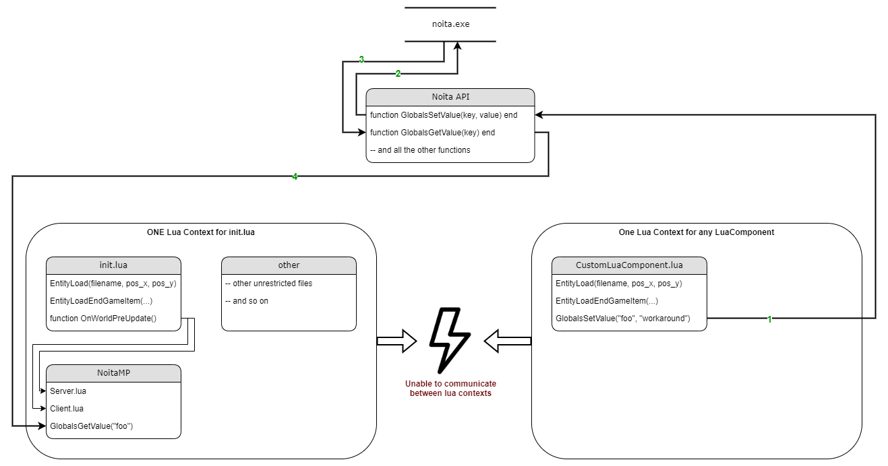

# Contributing to NoitaMP
I am happy to accept contributions to NoitaMP.\
Please follow these guidelines when contributing,\
but first off, thanks for taking the time to contribute!

## Table of Contents
- [Requirements](#requirements)
- [Important resources](#important-resources)
- 

## Requirements
- [ ] I have read the [Contributing](CONTRIBUTING.md) document.
- [ ] I have read the [Code of Conduct](CODE_OF_CONDUCT.md) document.
- [ ] I have read the [README](README.md) document.
- [ ] I have read the [LICENSE](LICENSE) document.
- [ ] I have experience in Lua.
- [ ] I have experience in Noita modding.

To be honest, I am sure that you have experience in Lua and Noita modding and if you read this, you will probably be able to contribute to NoitaMP.\
Everything will be explained here and if there are still questions, you can ask them in the [Discord server](https://discord.gg/DhMurdcw4k).

## How does NoitaMP work?
NoitaMP is a mod that uses the [Noita API](https://noita.wiki.gg/wiki/Modding), but there is something that you need to know about the API.\
The API is a Lua library that is used to interact with the game.\
The API is not a mod, it is a library that is used to create mods.\
There are different Lua contexts in Noita, but the most important one is the `init.lua` context.

Let me try to explain it with an example:

In the diagram above you can see the default Noita modding structure.\
There are different Lua contexts. One for `init.lua` and one context per each `LuaComponent`.\
You are able to use Noita API functions in each context, but you are not able to use functions from other contexts.\
In addition, unrestricted Lua code is only available in the `init.lua` context.\
This is why NoitaMP is only accessible in the `init.lua` context.

Assume we need a value in NoitaMP, which can only be fetched in LuaComponents. So in different Lua contexts!\
Then we would set a global "foo" variable in the `LuaComponent` context _(see 1 and 2 in the diagram below)_\
and afterwards we would use the `init.lua` context to fetch the value of the global "foo" variable _(see 3 and 4 in the diagram below)_.

See diagram below for a better understanding:

Please note that this is just an example and there are other ways to do this.\
In addition, please note that `GlobalsSetValue` and `GlobalsGetValue` has nothing to do with Lua globals `_G`.\
Another workaround is to use `VariableStorageComponents` to store values in the `LuaComponent` context and to fetch them in the `init.lua` context.

### Important resources
Along with this document, the following resources are important when contributing to NoitaMP:
- documentation
- bugs
- communication
